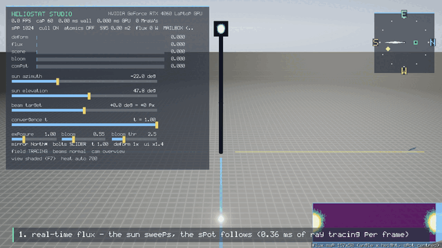

# Heliostat Studio — real-time visualization front-end

> Language: **English** · [中文](README_zh.md)



A hand-written **Win32 + Vulkan 1.4** real-time viewer for a GPU differentiable
ray-tracing research pipeline. No GLFW, no SDL, no ImGui, no stb, no glm, no
engine: the platform layer, swapchain, bitmap font, HUD widgets and the ray
tracing kernel that runs in the frame loop are all in this repository.

It renders the **flux spot** of a 12.84 × 9.45 m heliostat onto a 157 × 50 pixel
receiver cylinder in real time (log-mapped heat map + 5-level bloom + ACES), lets
you **drag the surface deformation** from a flat plate to the optimizer's result
(S95 spot area 226.67 → 46.26 m²) and shows **per-pass GPU milliseconds** measured
with timestamp queries — with three live A/B switches over the tracing kernel. The
frame also carries a **flux-map inset with its S95 contour**, an **NSWE compass with
ground cardinal markers**, a **Delingha (37.37N, 97.37E) summer-solstice day path**, and a **four-mirror
field in which only the selected mirror is actually ray traced**.

<details>
<summary>What the GIF above demonstrates (27 s, fixed reproducible timeline)</summary>

1. the sun sweeps, the spot follows (0.36 ms of ray tracing per frame);
2. receiver closeup — 157 × 50 heat map with bloom;
3. the convergence slider `t`: flat plate — optimized surface (S95 226.7 → 46.26 m²);
4. A/B switch: per-ray global atomics off (0.36 ms) / on (48.8 ms);
5. debug views: normals / slope error / plate height;
6. four-mirror field: N/E/S/W selected in turn, only the selected one traced
   (S95 46 / 55 / 176 / 53 m²);
7. the flux-map inset (`F`);
8. the Delingha day path at the summer solstice, sunrise to sunset (solar + Beijing time).

</details>

**The interesting part**: the same 4.04 M-ray workload the research pipeline
renders at ~83 ms per frame is traced here in **0.36 ms** (11.3 Gray/s) inside a
frame that costs **0.60 ms of GPU time in total** at full quality — and the
viewer's kernel reproduces the upstream reference flux map **bit-for-bit** (max
per-pixel difference 0.0 after the documented azimuthal roll; sum 480 462.0 W,
S95 226.67 m²).

> The research core this builds on (`src/`, `shaders/`, `data/`, `data_proxy/`)
> ships with its own README, kept at `docs/README_core_package.md`, and its
> numerical baseline at `data/baseline/BASELINE.md`.

---

## Three things to look at

| | |
|---|---|
| **1. Live spot** | The sun azimuth/elevation sliders drive the whole chain every frame: `computeBoltSurface → fluxLite → finalizeFlux → S95`. The receiver shows the flux texture directly (one quad per receiver pixel, sampled with the *corner convention of the physics*), so what you see is exactly the traced map. Note the honest behaviour: a real heliostat *re-aims* when the sun moves, so the spot stays locked on the aim point — what visibly changes is the plate's tilt and mirrored highlight, the incoming beam, and the spot's shape/peak with incidence angle (measured: peak 757 → 724 W/px, S95 221.4 → 221.7 m² between ±20° azimuth). |
| **2. Deformation** | The `t` slider interpolates the bolt strokes from zero to the 200-iteration optimized pattern; the plate is drawn by **vertex pulling from the compute-written `yGrid`/`nGrid` storage buffers** (no vertex buffer, no index buffer), and the S95 number updates live. |
| **3. Performance panel** | Per-pass GPU milliseconds from `vkCmdWriteTimestamp`, Mray/s, and three A/B switches over the *live* kernel: per-ray pre-cull, spp, and the upstream per-ray global atomics. Flipping the atomics switch takes the ray-tracing stage from **0.36 ms to 48.8 ms on the same work** (135×) — and the diagnostic-counter readback proves exactly `4 044 800` atomics per frame. |

---

## Build

Requirements: **Vulkan SDK 1.4+** (headers, loader and the bundled `slangc`) and
Visual Studio 2022. Nothing else, and no network access at build time.

```powershell
# NOTE: prefer a native cmake; an msys2/msys cmake on PATH can fail in restricted shells.
& "C:\Program Files\CMake\bin\cmake.exe" -S . -B build -G "Visual Studio 17 2022" -A x64
& "C:\Program Files\CMake\bin\cmake.exe" --build build --config Release
```

That produces two executables plus the SPIR-V next to them:

```
build\Release\heliostat_core.exe   headless forward engine (verified against upstream)
build\Release\heliostat_viz.exe    the real-time viewer
build\Release\shaders\*.spv        compiled by slangc, POST_BUILD copied here
```

## Run

```powershell
cd build\Release

# the viewer (assets and SPIR-V are found from any working directory)
.\heliostat_viz.exe

# scripted 15 s demo (camera + sliders driven by a fixed timeline; returns control
# to you at the end -- add --demo-exit to terminate, which is what the GIF used)
.\heliostat_viz.exe --demo 27 --validate
.\heliostat_viz.exe --demo 27 --demo-exit --hud-scale 1.7 --record ..\..\out\gif --record-stride 4

# scriptable state + widget geometry (used by the acceptance tests)
.\heliostat_viz.exe --state-log --ui-layout --log ..\..\out\logs\run.log

# numeric self-check: the viewer's kernel vs the upstream baseline flux map
.\heliostat_viz.exe --frames 40 --spp 1024 --sun 1 --t 0 --dump-flux ..\..\out\flux.npy
.\heliostat_viz.exe --frames 40 --spp 1024 --reference-chain --dump-flux ..\..\out\flux_ref.npy

# performance sweep -> CSV + plots
powershell -File ..\..\tools\perf_sweep.ps1
python ..\..\tools\plot_perf.py

.\heliostat_viz.exe --help
```

**Controls**: LMB orbit · RMB/MMB pan · wheel zoom · WASD/QE fly (Shift = fast) ·
the on-screen sliders (sun azimuth/elevation, beam target, convergence `t`, exposure,
bloom, **bloom threshold**) · `1` cull A/B · `2` spp ladder · `3` atomics A/B ·
`H` hide panel · `M` heat range · `K` re-centre the beam · `F` flux-map inset ·
`C` compass + ground cardinal markers · **`4`/`5`/`6`/`7` select the N/E/S/W mirror and
fly the camera to it** (`8` clears the field) · `9` Delingha day path (`0` off) ·
`L` animate the path · `←/→` step the hour angle · `[` `]` nudge `t` ·
`F11` frame-rate cap 60/120/off · cameras: `F1` field overview ·
**`F2` fly to the currently selected mirror** · `F3` receiver spot · `F4` beam side ·
`F5` bolt preset · `F6` deformation exaggeration · `F7` debug views (normals / slope
error / height) · `F8` beams · `F9` exposure · `F10` present mode · `Space` screenshot ·
`ESC` quit.

**Layout**: the top-left panel is *status only* (frame rate, per-pass GPU ms, the seven
sliders, the current mirror/surface state); the **operating guide sits at the bottom-left**,
the compass top-right and the flux map bottom-right. The default frame-rate cap is
**60 FPS** (`--fps 120`, `--fps 0` or `F11` to change it).

### Four things worth demonstrating live

| Feature | How | What it shows |
|---|---|---|
| **Flux-map inset** | `F` toggles (`--no-flux-map` starts hidden) | The 157×50 receiver flux texture drawn bottom-right with the **S95 contour** and the live `S95 / peak` numbers. It reuses the same 15-frame readback, so toggling costs **zero extra GPU time**. |
| **Delingha summer-solstice day path** | `9` cycles (summer solstice / equinox / winter solstice), `0` off, `L` animates, `←/→` step the hour angle | The site is **Delingha, Qinghai, China — 37.37°N, 97.37°E** (the 50 MW molten-salt tower plant), and the trajectory is that site's *real* day path: the declination follows the date (summer solstice **+23.44°**) and the hour angle sweeps sunrise — sunset. At the summer solstice the noon elevation is **76.07°** and the day is **14.58 h**; the HUD reports true solar time *and* Beijing time (the site is 22.63° west of 120°E, so Beijing = solar + 1h31m). The path drives the same physics chain as the sliders — it is not a demo mode. |
| **NSWE orientation** | `C` toggles | A compass top-right (N blue / E green / S red / W amber + a sun-direction diamond) and ground cardinal strips from 22 m to 320 m. Scene axes: **+Z = the direction the plate looks (south), +X = east**; −Z = north, −X = west. Sun azimuth is measured from **due south = 0°**. |
| **Four-mirror field, only the selected one is traced** | `4`/`5`/`6`/`7` **select and fly the camera to** the N/E/S/W mirror, `8` clears | Each mirror has its own foundation/tower/receiver chain; **only the selected one ray-traces**, the others are drawn as re-aimed flat plates, dimmed. Measured S95 (1024 spp, `t 1`): North **46.26**, East **55.39**, South **176.25**, West **52.67 m²**. |

> All four mirrors share the *same* North-optimized bolt preset, so E/S/W mean "the same surface,
> re-aimed", not independently optimized plates. The HUD says so (`mirror East (traced)`).

---

## Eight questions worth answering explicitly
**1. What is bloom, and why did turning it up produce unexpected bright blobs?**

Bloom is a post effect: bright-pass, then a 5-level 13-tap downsample / 9-tap tent upsample spread,
added back at the chosen strength. It changes no physics — only the glow around the sun disc, the
mirror highlights and the receiver core. The blobs came from the bright-pass **threshold**, which was
hard-coded at `1.0` while this scene's sky gradient already sits near 1.0 — so **the whole sky passed
the bright pass** and the 5-level blur smeared it into large halos; raising the strength amplified them
into blobs that look like they come from nowhere. Measured against the same frame with bloom off
(`docs/figs/bloom_threshold.png`, `tools/make_bloom_fig.py`):

| Bright-pass threshold (strength 1.5) | Pixels lit up by bloom | Share of frame | Strong halos | Max added |
|---|---|---|---|---|
| 1.0 (old hard-coded default) | **168 579** | **18.29%** | 9 668 | 0.325 |
| **2.5 (new default)** | **1 952** | **0.21%** | 498 | 0.307 |
| 6.0 (≈ off) | 0 | 0% | 0 | 0.008 |

Fixes: the knee now defaults to **2.5** (only genuinely HDR emitters glow: sun disc ≈16×, mirror
specular ≈8×, receiver core ≈3.6× — an **85× reduction** in halo pixels), a `bloomClamp = 6.0`
firefly guard stops one ultra-bright pixel from seeding a halo, and both a `bloom thr` slider
(0.5–8.0) and `--bloom-thr` exist so the 1.0 → 2.5 difference can be demonstrated live. So the blobs
were never a rendering bug — the threshold was simply too low.

**2. What is `convergence t`?**

`t` interpolates the bolt strokes from the flat plate to the 200-iteration end-to-end optimized
pattern (`boltHeight = t × optimizedHeight`). `t = 0` is the ideal flat plate, `t = 1` the fully
converged surface, and intermediate values are genuine intermediate states: the viewer really
recomputes the TPS + gravity surface for that bolt pattern and re-runs the whole tracer. Measured
spot area S95: **226.67 m²** at `t = 0` → **46.26 m²** at `t = 1` (a 4.8× contraction). `F5` cycles
converged / LSQ ellipse fit / zero bolts; the LSQ preset measures 47.86 m².

**3. Is the displayed surface the pre- or post-optimization shape?**

Post-optimization by default (`t = 1`, 200 iterations over 36 sun directions); press `F5` or drag `t`
to 0 to see the pre-optimization flat plate. Two clarifications: the mesh is **physically computed**,
not art — `computeBoltSurface` rebuilds TPS + gravity deformation on the GPU every frame and the
mirror is drawn by vertex-pulling the compute-written `yGrid`/`nGrid`; and `F6`'s 1×/50×/200× is a
**display-only** exaggeration that never enters the tracer, so every S95 number on screen comes from
the real surface (South degrading to 176.25 m² is physics, not exaggeration).

**4. What is the difference between the present modes, and what are the three bolt presets?**

`F10` cycles the three present modes (`--present fifo|mailbox|immediate`). They decide *when the
swapchain may hand a finished image to the display* — the picture itself never changes:

| Mode | Behaviour | Measured wall rate (59 Hz panel, cap off) |
|---|---|---|
| `FIFO` (vsync) | queue of 1: the app must wait for the display to take the image — no tearing, rate locked to the refresh | ≈ 59 FPS |
| `MAILBOX` (default) | queue of 3: a new frame **replaces** the pending one — no tearing, but the app is *not* locked to the refresh | 115 FPS (the display still shows 59) |
| `IMMEDIATE` | present immediately, no vblank wait — tearing possible, bounded only by the GPU | 841 FPS |

So "115 FPS" under MAILBOX is a *submission* rate, not "the monitor showed 115 frames" — which is
exactly why a deterministic 60 Hz cadence needs a software cap (`--fps` / `F11`); no present mode
gives you one.

`F5` cycles the three bolt presets (all of them real, computed stroke vectors):

| Preset | What it is | Measured S95 |
|---|---|---|
| **zero bolts** | the ideal flat plate — the "before optimization" reference | 226.67 m² |
| **LSQ ellipse fit** | single-parameter analytic fit (`North_300m_lsq_init.txt`), the pre-optimizer industry approach | 47.86 m² |
| **end-to-end optimized** | 36 sun directions × 200 differentiable iterations (the default, and the upper end of the `t` slider) | **46.26 m²** |

**5. What is the atomics A/B switch, and why does raising spp keep the frame rate high with it off?**

`3` toggles the **upstream kernel's per-ray global atomics** (unconditional in `forward.slang`): every
ray of every receiver pixel does one `InterlockedAdd(diagBuf[5], 1)` plus a *scattered*
`InterlockedOr(rayValidity[rayIndex >> 5], 1u << (rayIndex & 31))` on the ray-validity bitmap. The
live kernel exposes it as a switch precisely so the cost can be isolated:

| Configuration (1024 spp, 4.04 M rays) | flux stage GPU | Note |
|---|---|---|
| live kernel, atomics **off** | **0.358 ms** | shipped configuration |
| live kernel, atomics **on** | **48.79 ms (≈136×)** | the counter readback proves exactly `4 044 800` atomics per frame |
| same-address counter only (no scattered bitmap writes) | +3.5 % | i.e. virtually all of the cost is the *scattered* write traffic, not the counter itself |
| upstream reference chain (`forward.slang`, atomics always on) | 78.0 ms | upstream measured 5.2× inside its per-sun host-synchronised loop, where the atomic latency was not on the critical path |

**Why the frame rate stays high when spp goes up with atomics off**: the tracing stage is *linear* in
spp and, with the atomics off, its absolute cost is tiny — 0.086 ms at 64 spp and 0.358 ms at 1024 spp
against a 16.7 ms budget at 60 FPS. Going from 16 spp to 1024 spp multiplies the ray count by 64 and
still only adds ~0.28 ms, i.e. 1.7 % of the budget: the limiter is nowhere near the GPU (it is the
frame cap by default, and the ~7.9 ms present queue when uncapped). With the atomics on, the same work
costs 25–49 ms — *already over budget* — so raising spp multiplies an item that is over budget
already, and the frame rate collapses to 20–40 FPS.

**6. What does "fine-tuning the convergence" actually change?**

`[` `]` (and the slider) drive the same `t`: the **interpolation factor of the bolt stroke vector**,
`boltHeight = t × optimizedHeight` (keys step 0.7/s, the slider resolves 0.01). It is not a cross-fade
— every frame re-runs the physics:

1. the bolt heights go through `computeBoltSurface`, which superposes the TPS influence functions plus
   the 20-bin gravity model to produce a **new surface grid** `yGrid`/`nGrid` (compute shader, per frame);
2. the mirror mesh is drawn by vertex-pulling that grid (no vertex/index buffers), so the deformation
   is visible immediately and the normals are recomputed from the grid;
3. the same normals feed the tracer: each ray's reflected direction changes → the landing point changes
   → **the spot shape, peak and S95 are all recomputed**.

So what you see while fine-tuning is the spot contracting continuously from 226.67 m² to 46.26 m² and
the peak rising from 665 to 4808 W/px, with the S95 number in the panel updating every frame. The
intermediate values are **real intermediate surfaces** (`t = 0.5` is a plate with the bolts half
tightened), not a blend of two images.

**7. What does each key actually do, and why did some of them look dead?**

Every key now leaves a one-line amber acknowledgement in the panel for ~3.5 s (and a `[viz]` line in
the log), so "the switch fired but the picture barely changed" is distinguishable from "the key is
broken". Two of them *were* broken:

| Key | Effect | Note |
|---|---|---|
| `M` | heat-map range **auto <-> fixed** | auto tracks the read-back peak x1.25 with a slow fall-off; fixed pins the ceiling where it is. With a stable peak the picture barely changes, which is why the panel now prints `heat AUTO/FIXED<=5940` and the toast names the new ceiling |
| `8` | **field ray tracing on/off** | off means the whole compute chain is simply not recorded: the flux pass reads **0.000 ms** in the per-pass table (frame GPU 0.34 -> **0.240 ms**), the receiver goes cold, S95/peak read 0 and the field is not drawn. The kernels themselves are untouched |
| `[` `]` | **convergence fine-tune t** (+-0.02 per tap, 0.7/s while held) | these used to do nothing at all: `[`/`]` are not VK codes (they arrive as `VK_OEM_4`/`VK_OEM_6`), so the old ASCII comparison never matched |
| `F4` | camera: **beam side view** | looks along the selected mirror's bearing +60 deg from 190 m, so the incoming and reflected beams cross the frame |
| `F7` | four plate views | the panel now names the active one: `shaded` / `normals` / `slope error` (vs the macro normal, 30 mrad full scale) / `height` (+-60 mm) |
| `F8` | **beams: off / normal / strong (2x)** | the beams are a faint additive effect (`alpha ~0.16 x pulse`), so the panel now shows `beams normal (F8)` |
| `F9` / `U` / `F11` | exposure x1.25 (`Ctrl+9` back) / **UI scale AUTO..3x** / frame-rate cap 60-120-off | all three report their state in the panel |
| `F1`-`F4` | camera presets (field / fly to selected mirror / receiver spot / beam side) | the panel shows `camera: <current>` |
| `1` `2` `3` | A/B: A1 pre-cull / spp ladder / per-ray global atomics | `cull` and `atomics` are shown in the header, `2` toasts the new spp |
| `F5` `F6` | bolt preset / deformation exaggeration 1x-50x-200x | `F6` is display-only and never enters the tracer |
| `P` `K` `H` `L` `F` `C` | pause / re-centre beam / hide panel / animate day path / flux inset / compass + markers | all announced |

**8. Why are some actuator markers invisible, and why did the S300m mirror's markers leave the mirror?**

Two independent causes, **both on the display layer** (the physics never changed: parity is CLI
1.951e-07 and per-pixel 0.0 before and after):

1. **The marker cloud and the plate were built in two different frames.** The plate uses the
   per-mirror field record (`helioPosOf`/`helioToWorldDir`); the markers used the *engine's*
   scene-level macro basis (`scene.macroN/U/V`). The engine recomputes that basis from the
   **beam-target aim offset** (a real heliostat does re-aim), while the viewer's plate basis ignored
   the offset — so the two frames diverged. Measured with the offset at ±60°: the South mirror's two
   frames differ by **7.91°** and **all four corner markers leave the plate (up to 0.83 m off)**;
   the North mirror only differs by 0.93°, because the South mirror's macro normal is nearly vertical
   (nY = 0.990) and its frame is therefore hypersensitive to the aim point. Fixed by drawing the
   markers in the same per-mirror frame as the plate, and by making `aimPointFor()` honour the aim
   offset so the *drawn* plates match the *traced* ones too.
2. **The `F2` closeup has always framed the plate from behind** (the camera sat ~10 m on the negative
   side of the surface normal), and an opaque plate hides everything that lives on its front face:
   the actuator markers, the glass coating and the specular highlight. Fixed by framing the closeup
   from the reflecting side (`yaw = azimuth(n) + 22°`, `pitch = elevation(n) + 14°`).

Two more rough edges were fixed in the same pass: the marker used to be an octahedron **centred** on
the node (its lower half buried inside the opaque plate, so you only ever saw half of it) — it is now
a small box whose base sits on the surface — and the marker height was sampled at the **nearest grid
node** while the plate rasterises a **bilinear** interpolation of the same grid (at F6's 50×/200×
exaggeration the markers visibly floated or sank). `tools/bolt_probe.py` (render with the marker size
set to 0 and to 0.30 m, subtract the frames to isolate the markers, count connected components) now
reports **35 / 35 / 34 / 35** visible markers for N/E/S/W (two South markers merge in perspective),
and the new `[state]` diagnostic reports `boltsOut 0 / worst 0.00 m / frame — .03°` for every mirror
and every beam-target angle. Note that in the overview preset the markers are invisible as a matter of
*geometry*, not as a bug: that camera is almost coplanar with the mirror plane (9.8 m off the plane at
227 m ≈ 2.5° grazing), where a 0.44 m stud projects below one pixel — use `F2` or `--bolt-scale 0.5`.

---

## Performance (measured, RTX 4060 Laptop, 1280×720, vsync off)

GPU ms = `vkCmdWriteTimestamp` deltas; wall ms = `steady_clock` around the whole
iteration (includes present and the OS compositor); the uncapped figures use
`VK_PRESENT_MODE_IMMEDIATE_KHR`. **All FPS values below are the `--fps 0` (cap off)
numbers** — with the default 60 FPS cap the wall time is 16.7 ms by construction.
Raw rows: `docs/perf_viewer.csv` and
`docs/perf_log.md`. Plots: `docs/figs/frametime_vs_spp.png`,
`docs/figs/ab_switches.png`, `docs/figs/pass_breakdown.png`.

| spp | rays/frame | flux pass (GPU) | GPU total | wall (IMMEDIATE) | throughput |
|---|---|---|---|---|---|
| 16 | 63 k | 0.082 ms | 0.204 ms | 0.88 ms (1137 FPS) | 0.8 Gray/s |
| 64 | 253 k | 0.086 ms | 0.208 ms | 0.91 ms (1097 FPS) | 2.9 Gray/s |
| 256 | 1.01 M | 0.121 ms | 0.242 ms | 1.20 ms (835 FPS) | 8.4 Gray/s |
| 1024 | 4.04 M | **0.357 ms** | **0.57–0.63 ms** | 1.19–1.41 ms (708–843 FPS) | **11.3 Gray/s** |

Per-pass breakdown at 1024 spp (GPU, ms, **final build with every new feature on by
default**): deform 0.019 · **flux 0.356** · scene 0.049 · bloom (9 passes) 0.078 ·
composite 0.011 · **total 0.602**; the same run with `--no-ui --no-flux-map` measures
**0.551**, i.e. the new overlays cost about **0.05 ms** while the tracing stage is
unchanged. With the default `MAILBOX` present mode the wall clock sits at the present
queue instead (~8.7 ms → 115 FPS on a 59 Hz panel); the HUD shows both.

A/B switches on the same 4.04 M-ray workload:

| configuration | flux stage (GPU) | wall | note |
|---|---|---|---|
| real-time kernel (`flux_lite.slang`) | **0.358 ms** | 1.12 ms | the shipping configuration |
| A1 pre-cull disabled | 0.351 ms | 1.24 ms | the cull skips the refraction + sun-shape work for rays that provably contribute 0 |
| **per-ray global atomics ON** | **48.79 ms** | 47.6 ms | upstream's `InterlockedAdd(diagBuf[5])` + scattered `InterlockedOr(rayValidity[…])`, 4 044 800 atomics/frame (verified by reading the counter) |
| reference chain (`forward.slang`, upstream file, atomics unconditional) | 78.0 ms | 84.2 ms | the parity reference, run in-process for comparison |

The 135× atomic result is not the upstream's published 5.2×, and the difference is
the point: that number was measured inside a per-sun loop that synchronised the host
six or seven times per render (see `data/baseline/BASELINE.md`), so the atomic's
latency was *exposed on the critical path*. With one submit per frame and two frames
in flight, the same traffic costs only what it costs on the GPU. Both measurements
are recorded in `docs/perf_log.md`.

Reference numbers from the headless engine (`heliostat_core`, same workload):

| path | GPU | wall per render |
|---|---|---|
| `--bench 200` (render only, 1024 spp) | 0.50 ms | 0.64 ms |
| `--bench-readback 200` (equivalent to the upstream per-sun loop) | 0.50 ms | 1.09 ms |
| upstream research repo, per sun | — | ≈ 83 ms |

---

## Numerical parity

`viz/shaders/flux_lite.slang` is a derivative of `shaders/forward.slang` that stays
byte-for-byte faithful in its physics. Verified with the viewer's own `--dump-flux`
and a few lines of numpy:

| check | result |
|---|---|
| `heliostat_core --parity` (upstream baseline NPY) | flux sum rel. **1.95e-07**, peak 664.911 identical, S95 level 75.207809 identical, S95 area 226.67 m² (0.00 %) |
| viewer `flux_lite` (1024 spp) vs upstream baseline NPY, per pixel | **max abs diff 0.000000e+00** after the documented 79-pixel azimuthal roll; sum 480 462.0 W identical |
| viewer `flux_lite` vs the viewer running `forward.slang` in the same process (same UBOs, same descriptor set) | **per-pixel diff 0.0** — the real-time kernel is an exact reproduction of the verified one |
| viewport S95 (GPU cooperative bisection) vs the CPU reference implementation | 0.00e+00 relative (bit-identical) |

`flux_lite` differs from `forward.slang` in exactly three documented ways: spp and
the tile count come from a push constant, the per-ray diagnostics sit behind the A/B
switch, and clear/finalize use a runtime tile count. At 1024 spp the sample sub-grid
degenerates to the upstream ordering `xid = sp/32, zid = sp%32`, which is what makes
the bit-exact match possible (at lower spp the samples stay spread over the whole
plate instead of collapsing onto two grid rows).

---

## Architecture

```
one vkQueueSubmit per frame, 2 frames in flight, no per-frame allocation
│ 
├─ compute  clearFluxLite         (10,4)         new: runtime tile count
├─ compute  computeBoltSurface    (1,1,1)        reused upstream SPIR-V (TPS + 20-bin gravity)
├─ compute  fluxLite              (tiles, 3950)  new: spp 16..1024, cull/atomics A/B
├─ compute  finalizeFluxLite      (10,4)         new
├─ compute  computeS95FindLevel   256×1          reused upstream (cooperative bisection)
│     + sample readback every 15 frames -> S95 area, flux sum, verified counters
├─ graphics scene       sky / ground / tower / receiver (157×50 emissive quads)
│                       / plate (vertex pull from yGrid+nGrid) / 35 bolt nodes / beams
├─ graphics bloom ×9    bright pass + 4× 13-tap down + 4× tent up (5 levels, half res)
├─ graphics composite   ACES + exposure + vignette -> sRGB swapchain (dynamic rendering)
└─ graphics hud         5×7 bitmap font + panel + sliders, one vertex buffer, no ImGui
```

Frame-loop rules that are enforced in the code (`viz/src/viz_main.cpp`,
`viz/src/vk_context.cpp`):

* **one submit per frame**, 2 frames in flight, per-image fences, `MAILBOX`/`IMMEDIATE` present;
* **no `vkQueueWaitIdle` / `vkDeviceWaitIdle` on the frame path** — the only device idle is in
  `recreate()`, which runs on a resize event. Every run prints how long the loop was actually
  blocked (e.g. *900 frames: slot-fence 2.8 ms + image-fence 17.1 ms total*);
* **zero per-frame allocation**: buffers, textures, descriptor sets, query pools and pipelines are
  created at init; per-frame data goes into persistently mapped UBO slices, one per frame slot;
* **every readback is delayed**: GPU timestamps for frame N are read after that slot's fence
  (two frames later), the flux map every 15 frames, screenshots two frames after their copy;
* every HDR/bloom target exists **per frame in flight**, so frame N+1 cannot overwrite what
  frame N is still reading.

Reuse map (what is upstream and what is new) — `NOTES_provenance.md` has the file-level table:

| reused unchanged | new in this package |
|---|---|
| `shaders/common.slang`, `sunshape.slang`, `bolt_common.slang`, `forward.slang` (the parity reference), `s95_gpu.slang`, `bolt_forward.slang` | `viz/shaders/flux_lite.slang`, `scene.slang`, `post.slang`, `hud.slang` |
| `src/vk.cpp` (compute wrapper), `src/data.cpp`, `src/engine.cpp` dispatch chain, push constants, binding numbers, UBO bit layout | `viz/src/{platform_win32, vk_context, vk_gfx, vk_flux, vk_scene, vk_post, hud, gpu_timer, camera}.cpp` |
| the flux/S95 physics, the TPS + gravity plate model, the active-pixel culling | the whole graphics layer, the frame loop, the HUD, the perf plumbing |

Two latent defects in the core were found and fixed while doing this (both recorded in
`docs/perf_log.md`; neither changes any physics):

1. `forward.slang` writes a per-ray validity bitmap at binding 29 with indices up to ~250 k
   (—  MB) while the engine bound a 4 KB dummy there — an out-of-bounds device write that
   survives on some allocation layouts and took the device down on others.
2. `loadConfig()` silently returns defaults for an unreadable path, and the CSR-derived Buie
   constants are only computed on the file path — so starting the viewer from `build\Release`
   with a relative config path silently changed the sun shape and made the flux 68× too
   large. The viewer now resolves the config explicitly and warns.

Four more were found by the user and by the automated tests afterwards — the full table with
evidence is in `docs/perf_log.md` (the fix-round section); the two that mattered most:

3. **The receiver heat map was never drawn**: the scene UBO packed `pixelHeight` one float
   too far (`ground.w`), so the cylinder was built with 12 rows instead of 50 and sampled the
   top rows of the flux texture while the spot sits in rows 22-28. With the fix the
   heat-mapped pixel count went from 2 285 to 53 682 and now responds to the `t` slider
   (240 px tall lit region flat, 106 px focused).
4. **The bolt presets never loaded** (they were looked up under `data_proxy/bolts` instead of
   `data/bolts`), so the convergence slider and `F5` did nothing and S95 stayed at the flat
   plate value. Now `--t 1` gives S95 46.26 m² / peak 4808.1 W/px, matching the CLI exactly.

Also fixed: the HUD was drawn vertically mirrored (the overlay draws straight to the swapchain,
so it must map its top-left origin to `ndc.y = -1`, unlike the scene pass which goes through the
composite), mouse clicks did not update the pointer position (a click without a preceding move
missed every widget), and `--demo` used to terminate the process when the scripted sequence
ended (now it returns control; `--demo-exit` opts in).

---

## Repository layout

```
├─ src/, shaders/, data/, configs/, data_proxy/   the verified research core
├─ viz/src/        the viewer: platform, swapchain, graphics passes, HUD, timer, camera
├─ viz/shaders/    flux_lite.slang, scene.slang, post.slang, hud.slang
├─ tools/          bmpstat.py, gen_font.py, perf_sweep.ps1, plot_perf.py, make_gif.py,
│                  make_stills.ps1, make_bloom_fig.py, bloom_probe.py, inset_probe.py,
│                  hud_probe.py, bolt_probe.py, acceptance_window.ps1,
│                  acceptance_interaction.ps1
├─ docs/perf_log.md, docs/perf_viewer.csv, docs/figs/
└─ PLAN.md, PROMPT.md, NOTES_provenance.md
```

`tools/bmpstat.py` deserves a mention: it prints region statistics and an ASCII
luminance preview of a frame, which is how every visual change in this project was
checked from a terminal. `tools/acceptance_window.ps1` drives resize / minimise /
restore / the A/B keys from the outside and fails on any validation-layer message.
`tools/bloom_probe.py` measures how much of a frame a bloom setting lights up (and
diffs it against a bloom-off reference), which is how the "unexpected bright blobs"
question above was answered with numbers; `tools/inset_probe.py` and
`tools/hud_probe.py` do the same job for the flux-map inset placement and the HUD
layout (the latter by diffing a `--no-ui` frame against a normal one).

## Verification summary

| check | command | result |
|---|---|---|
| physics parity | `heliostat_core --parity …` | rel. 1.95e-07, S95 bit-identical |
| viewer kernel parity | `heliostat_viz --dump-flux` + numpy diff | per-pixel 0.0 vs baseline and vs `forward.slang` |
| API correctness | `heliostat_viz --validate --demo 27` | **0 errors, 0 warnings** (empty stderr, 3138 frames at 115.9 FPS) |
| window robustness | `powershell -File tools/acceptance_window.ps1 -Validate` | 5 resizes + minimise/restore/maximise + key events: PASS, 8 swapchain recreations, clean exit |
| **widget interaction** | `powershell -File tools/acceptance_interaction.ps1 -Validate` | **PASS 8/8**: convergence slider moves S95 45.78 → 222.19 m², sun azimuth 4.31°→42°, beam target 0→+36°, `2` cycles spp, validation clean, exit 0 |
| flux inset drawn / hidden | `--screenshot` + `tools/bmpstat.py` region stats | 73 % of the inset rect is heat-coloured with a 1 px border; with `--no-flux-map` the rect returns to scene pixels |
| compass + ground markers | colour counts on one frame | N 345 px, E 53, S 20, W 24, sun diamond 85; E/W strips share ground row y=440–441 (cols 200–600 / 700–1100), N is a vertical strip, S is occluded by the tower as expected |
| per-mirror tracing | `--mirror 0..3 --spp 1024 --t 1` | S95 N/E/S/W = 46.26 / 55.39 / 176.25 / 52.67 m² |
| **flux inset centring** | `tools/inset_probe.py` (4 mirrors + the `--no-inset-centre` counter-example) | **PASS**: centroid offset ≤ 2.5 px, horizontal spread ≤ 12 texels of 157; the counter-example's North spot peaks 177 px off-centre with a 72.8-texel spread (split across the u = 0 seam) |
| **actuator markers** | `tools/bolt_probe.py` (marker-off/marker-on diff + connected components) | **PASS**: 35 / 35 / 34 / 35 visible markers for N/E/S/W (two merge in perspective) |
| **bolt/plate frame consistency** | `[state]` diagnostic `boltsOut / worst / frame / nrm` | 0 corners outside the plate, 0.00 m overshoot, ≤ 0.03° frame error for all four mirrors at aim 0, +60° and −60° (was 4 corners / 0.83 m / 7.91° on South before the fix) |
| **mirror keys + every toggle** | `powershell -File tools/acceptance_keys.ps1` | **PASS 13/13**: `4`/`5`/`6`/`7` switch the traced mirror to N/E/S/W **and** fly the camera to it (yaw 23.91 / −27.91 / 186.02 / 75.24°); `8` toggles the field's ray tracing; `M` / `F7` / `F8` / `U` cycle the heat range, plate view, beams and UI scale; `[` lowers t to 0.49 and `]` raises it back to 1.00; every toggle leaves an acknowledgement line in the log |
| **field tracing off (`8`)** | per-pass table after pressing `8` | `deform 0.000 | flux 0.000 | ... | total 0.240 ms` (vs ~0.34 ms with the chain recorded); S95/peak read 0 and the receiver goes cold |
| **UI scale + panel fit** | `tools/panel_probe.py` (UI-on minus UI-off diff) | panel occupies **17.9 %** of the frame at 1280×720, **18.0 %** at 1920×1080 (auto 1.5×), 18.2 % at 2560×1440 (auto 2×); 26–42 % of the box is actual content (it was **0 %** — an empty panel — before the fix); forcing 3× at 720p settles at 1.84× instead of clipping |
| **Delingha day path** | `--sunpath 1 --sun-hour H` + `[state]` | noon (H = 0): az **0.00°**, el **76.07°**, solar 12:00, Beijing 13:31, day length **14.578 h**; the sunrise/sunset ends sit at el 2.78° (equinox 52.63°, winter 29.19°) |
| **HUD layout** | `tools/hud_probe.py` (with-UI minus no-UI diff) | panel 472×312 top-left, guide strip bottom-left, compass top-right (132×137), inset bottom-right; HUD pixels in the frame centre: 0.8 % (animated beams only) |
| frame-rate cap | `--fps 60 / 120 / 0` | 59.9 / 119.8 / 126.8 FPS measured wall |
| frame-loop stalls | end-of-run counter print | see `docs/perf_log.md` |

> Two testing gotchas worth knowing: the viewer is **DPI aware** while PowerShell is not, so on
> a 125 % display an unaware test process sees a 1024×576 client area instead of 1280×720 and
> every synthetic click lands ~25 % off; and widget hit testing reads the **real pointer**
> position, so an automated test must actually move the cursor (`SetCursorPos`) — posted
> coordinates get overwritten by the next genuine `WM_MOUSEMOVE`.
